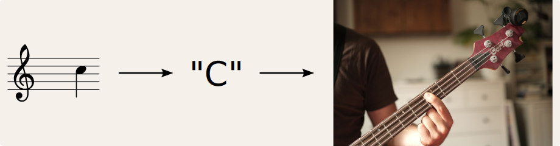

Hi there!

I am actually going to get *real* bass lessons with the great [Gerben](https://www.youtube.com/watch?v=6jJUr8acJnQ) [Brys](https://graduation.schoolofartsgent.be/student/gerben-brys) :) I am excited, and look forward to it.

The [Akademie](https://www.stedelijkonderwijs.be/academie-wilrijk) invites (*forces*) me to practice musical theory. Which I am bad at. More a rhythm person, I decided to skipped the introductory year.

A common task is to parse a note on sheet music, to some mental representation (e.g. a &ldquo;C&rdquo;), to a note played on the guitar.



And I would like to track my practicing progress.

Here is the recipe for a simple python program:

-   used &ldquo;lilypond&rdquo; with latex to get very basic note sheets:
    -   <https://martin-thoma.com/how-to-write-music-with-latex/>
    -   <https://lilypond.org/doc/v2.24/Documentation/notation/writing-pitches>
    -   see <notes.tex> for raw notes (no sharps/flats yet); `lilypond-book --output=out --pdf notes.tex` produces subfolders with little `pdf` sheets
-   converted the LaTeX `pdf` to `svg` and further to `png`:
    -   `pdf2svg test.pdf test.svg && inkscape -w 1024 test.svg -b white -o test.png`
-   write a tiny `python` script which displays a note and records time

For practice, I would stand on my computer, which displays a random note,

-   which I say out loud,
-   then play on the bass,
-   and press any key on my keyboard to record time.

Nothing fancy. I use it from the linux terminal and exit by `[ctrl]+[c]`. Maybe this is of use for anyone.

Enjoy yourselves!

```python
# \m/,(> . <)_\m/
```
